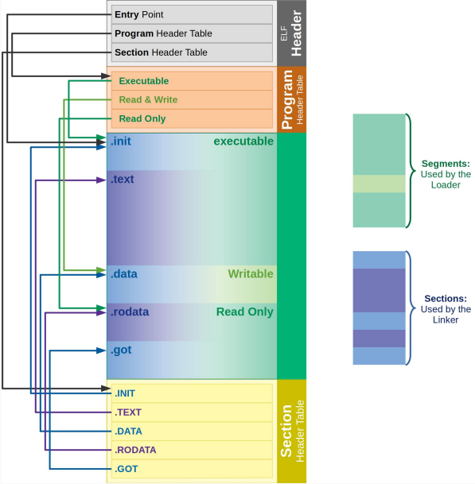

[manuales de Intel](https://www.intel.com/content/www/us/en/developer/articles/technical/intel-sdm.html)

- El volumen 1 describe la arquitectura básica
- El volumen 2 es la referencia del conjunto de instrucciones, que también pueden consultar en [felixcloutier](https://www.felixcloutier.com/x86/). Este es el que más les va a servir en las próximas clases.
- El volumen 3 es la guía de system programming, la vamos a usar en la segunda parte de la materia.

Contamos con el siguiente esquema de registros:

Recuerden que las versiones de distintos tamaños de un mismo registro (por ejemplo: RAX, EAX, AX, AH, AL) conviven en el mismo circuito físico, es decir, EAX referencia a los 32 bits menos significativos del registro RAX, no se puede modificar el contenido del primero sin alterar el del segundo.

## Instrucciones

Tenemos muchas instrucciones disponibles, cuya sintaxis suele seguir una lógica común:

- Instruciones sin operandos (o con operandos implícitos). Ej: `ret` para retornar a la función llamadora.
- Instrucciones con un operando: puede ser un registro, una posición de memoria, un inmediato. Ej: `jmp .fin` salta a la etiqueta `.fin`, `call foo` llama a la función foo.
- Instrucciones con dos operandos: por lo general el primer operando es el destino (dst), donde se almacenará el resultado de ejecutar la instrucción, y el segundo operando es la fuente (src).
  - Hay que tener en cuenta que para muchas instrucciones el operando destino también es fuente.
  - Los pares dst-src pueden ser registro-memoria, registro-registro, memoria-registro, registro-inmediato y memoria-inmediato. Nótese como no es posible un par memoria-memoria, las lecturas siempre deben acabar en un registro y las escrituras siempre deben partir de uno o bien de un valor inmediato.
  - Los inmediatos pueden ser:
    - Decimales: 200
    - Hexadecimales
      - con el prefijo `0x`: 0xC8
      - con el prefijo `0h`: 0hC8
    - Octales, con el prefijo `0q`: 0q310
    - Binarios:
      - con el sufijo `b`: 11001000b
      - con el prefijo `0b`, que permite guiones: 0b1100_1000
  - Al trabajar con lecturas y escrituras de memoria hay que tener en cuenta el tamaño del dato que se está leyendo/escribiendo, de lo contrario acabaremos leyendo/escribiendo direcciones de memoria que no corresponden. Para especificar el tamaño de la lectura/escritura, es preciso utilizar el tamaño de registro correcto y añadir el tamaño (BYTE, WORD, DWORD) en el operando de memoria.
  - Ejemplos:
    - Registro-Registro:
      - `add rdi, rsi`
    - Memoria-Regitro: 
      - `mov [LABEL], rax`
      - `sub r10, [rdx + 4*rax + OFFSET]`  (Direccionamiento visto en la teórica: [Base + Indice * Escala + Desplazamiento])
      - mov ecx, DWORD [rbp - 8]
      - add BYTE [rdi], sil
    - Registro-Inmediato:
      - `sub rsp, 8`

## Herramientas

Para ensamblar vamos a usar NASM. Está diseñado para varios sistemas operativos y distintas versiones de ANSI-C, por eso tiene varios formatos de salida. Como trabajaremos con Linux, vamos a utilizar elfx32, elf32 y elf64, que generan formatos de salida ELF32 y ELF64 (Executable and Linkable Format) en los archivos objeto.

En la sección _Material de cursada_ del campus virtual van a encontrar links para instalar todas las herramientas que vamos a usar durante el cuatrimestre. Si están trabajando en las compus de los labos ya deberían tener todo instalado.

## Convención de llamadas

La convención de llamadas define:

- En qué registros o posiciones de memoria deben estar los parámetros para llamar a una función (o donde esperarlos, desde el punto de vista de la función llamada).

  - En 32 bits, los parámetros se pasan pusheados a la pila de **derecha a izquierda**¹.
  - En 64 bits, los parámetros se pasan por distintos registros según su tipo:
  
    - Enteros y punteros se pasan por RDI, RSI, RDX, RCX, R8 y R9 (de **izquierda a derecha**²).
    - Flotantes se pasan por XMM0, XMM1, ... , XMM7 (de **izquierda a derecha**²).
    - Para todos los tipos, si se agotan los registros antes mencionados (hay más pero no forman parte de la convención, por ejemplo los XMM del 8 al 15), se pasarán por la pila pusheando de **derecha a izquierda**¹.
- En qué registro esperar el valor de retorno de la función llamada (o donde escribirlo, desde el punto de vista de la función llamada).
  
  - En 32 bits, el valor de retorno se espera en EAX.
  - En 64 bits, el valor de retono se espera en RAX, si es un entero o puntero, y en XMM0 si es un flotante.
- Qué alineamiento debe tener la **pila** (**stack**) al llamar a una función. Tanto en 32 como en 64 bits, la pila debe estar alineada a 16 bytes al momento de llamar a una función de C. ¿Por qué? Hay funcioes que hacen uso operaciones de registros largos (XMM, YMM) que requieren datos alineados a 16 bytes. Si nosotros al llamar a una función no respetamos la alineación y resulta que esa función no llama a ninguna otra que dependa de la alineación de la pila para operar, no pasa nada. Pero si sin que lo sepamos llama a otra que utiliza dichas operaciones, no va a chequear el estado de alineación de la pila antes de hacerlo, porque asume que fue llamada con la pila correctamente alineada, y por tanto va a fallar.

¹ En relación al orden en que están en la declaración de la función. También se puede decir que se pushean desde el último al primero.

² También en relación al orden en que están en la declaración de la función.

## Convención de registros

¿Qué pasa con los registros en uso al realizar una llamada? ¿Conservan sus valores al regresar? Algunos sí, otros no.

Vamos a dividir los registros entre
- ***no volátiles*** o ***callee-saved***: la función llamada debe encargarse de que, al terminar, estos registros tengan los mismos valores que al comienzo. Estos son:
  
  - En 64 bits: RBX, RBP, R12, R13, R14, R15.
  - En 32 bits: EBX, EBP, ESI, EDI
  
- ***volátiles*** o ***caller-saved*** : la función llamada no tiene obligación de conservarlos, si los quiere debe conservalos la función llamadora. 

Menciones especiales: 

- RSP/ESP se puede considerar como un registro no volátil dada su función específica como tope de la pila.
- R10 y R11 no están ni en el grupo de los registros por los que se pasan parámetros ni en el grupo de los registros no volátiles, no se olviden de su existencia.
- XMM8 a XMM15 no están en el grupo de los registros por los que se pasan parámetros pero están a disposición, no se olviden de su existencia.

 
    
